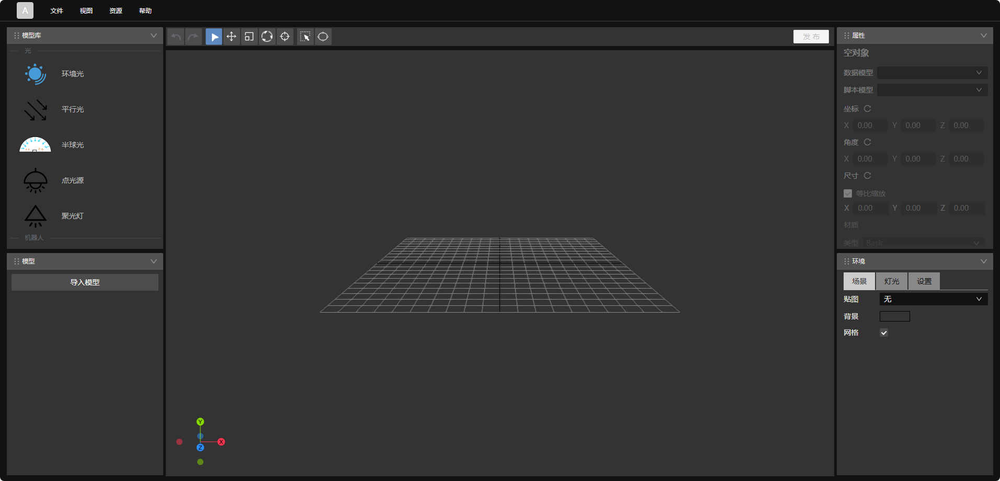

<h2> Hi 欢迎来访我的GitHub </h2>

我的网名是`今童志敏（alindas）`，是一名全栈开发工程师。拥有前端基建、跨端应用、3D数字孪生、Node后台等开发经验。 
目前，我主要关注在：人工智能、程序员的可持续发展。下方可以看到我开源的相关项目repo。

<em><b>I am a fun guy</b>  if you want to <a href="https://github.com/alindas/alindas/issues/new" >say <b>"hi 👋" </b></a>, <b>I'll be happy to meet you more!</b> : )</em>

 &nbsp;&nbsp;&nbsp;&nbsp;

**Things I code with**

          
   

**Tools I code with**

   

 

---

> 另外，也可以在这些平台上找到我

<!-- other platform -->

  
  &emsp;
  
  &emsp;
  
  &emsp;
    
  <strong>Check out my work below!</strong>
    
  
  
  
  
  

<!-- other platform -->
<!-- github stats -->

  <a href="https://github.com/alindas" class="rich-diff-level-one">
    
    <!-- &hide=issues
    
    --
  </a>

<!-- github stats -->

### 🖥️ Open-Source Projects &emsp; <a href="https://github.com/alindas?tab=repositorie"><code></code></a>

#### <a href="https://github.com/alindas/devBoard" target="_blank" >DevBoard</a>

 

用于构建二次开发场景的组件配装面板。支持 React。

线上演示: https://alindas.github.io/devBoard/

npm包: https://www.npmjs.com/package/react-lc-panel

 

---

#### <a href="https://github.com/alindas/3d-building-block" target="_blank" >3D场景编辑器</a>
基于组态思想搭建三维场景。

线上演示: https://alindas.github.io

 

